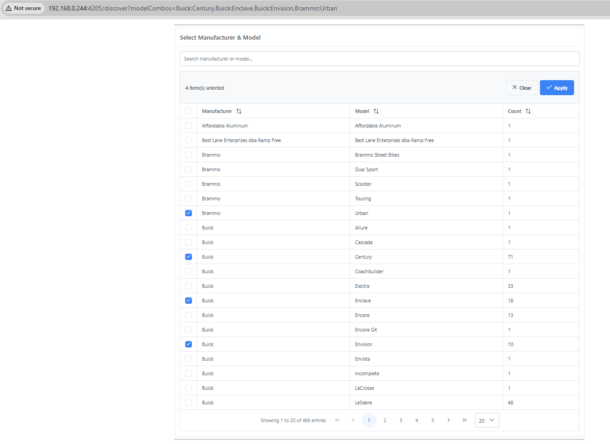
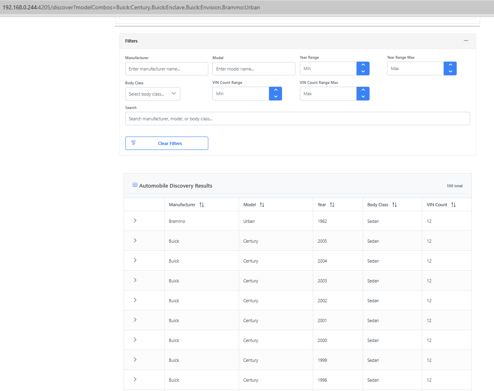

# Generic Discovery Framework

[](https://github.com/CompSci2013/generic-prime/releases)
[](LICENSE)

**A domain-agnostic Angular 14 framework for browsing and analyzing data across multiple domains** (automobile, agriculture, real estate, etc.). Built with a **PrimeNG-first architecture** that leverages native PrimeNG capabilities instead of custom components.

## 🎯 Key Principles

1. **PrimeNG-First**: Use PrimeNG Table directly, no custom table wrappers
2. **Configuration-Driven**: Domain specifics in config files, not code
3. **URL-First State**: URL is the single source of truth
4. **Plan-Driven**: Follow revised architecture in [`plan/`](plan/) directory

## ✨ Features

### Current (v0.1.0)

- ✅ **Configuration-Driven Picker Component**
  - Multi-select manufacturer-model combinations
  - Server-side pagination (20 items/page, configurable)
  - Real-time search filtering
  - Column sorting (manufacturer, model, count)
  - Flattened API response handling for nested data

- ✅ **URL-First State Management**
  - Bookmarkable selections (`?modelCombos=Buick:Century,Ford:F-150`)
  - Browser back/forward navigation
  - Multi-tab synchronization
  - Cross-window communication (pop-outs)

- ✅ **Integrated Results Filtering**
  - Picker selections automatically filter results table
  - Real-time count updates (e.g., 4887 → 100 filtered results)
  - Seamless integration via URL parameters

- ✅ **PrimeNG-First Architecture**
  - Uses native `<p-table>` components directly
  - 85% code reduction vs. custom implementations
  - Built-in sorting, filtering, pagination, state persistence

## 📸 Screenshots

### Manufacturer-Model Picker

*Multi-select picker with search, sort, and pagination*

### Filtered Results

*Results table automatically filters based on picker selections (100 results from selected models)*

## 🏗️ Architecture

### Technology Stack

- **Frontend**: Angular 14, TypeScript
- **UI Framework**: PrimeNG (tables, forms, dialogs)
- **Charts**: Plotly.js
- **State Management**: RxJS, URL-based routing
- **API**: RESTful microservices (Specs API, VINs API, Auth API)
- **Backend Data**: Elasticsearch (4,887 vehicle specs + 55,463 VIN records)

### Core Architecture

```
src/
├── framework/                    # Domain-agnostic framework
│   ├── services/
│   │   ├── resource-management.service.ts  # Generic state (660 lines)
│   │   ├── url-state.service.ts           # URL parameter management
│   │   ├── request-coordinator.service.ts  # Cache, dedup, retry
│   │   └── picker-config-registry.service.ts
│   ├── models/
│   │   ├── domain-config.interface.ts
│   │   ├── picker-config.interface.ts
│   │   └── table-config.interface.ts
│   └── components/
│       ├── base-picker/          # Configuration-driven picker
│       └── results-table/        # Configuration-driven table
│
├── domain-config/automobile/     # Domain-specific configs
│   ├── models/                   # SearchFilters, VehicleResult
│   ├── adapters/                 # API adapters, URL mappers
│   └── configs/                  # Table, picker, chart configs
│
└── app/features/discover/        # Main discovery page
```

### Key Design Patterns

**1. Configuration-Driven Components**
```typescript
// Define picker once, reuse everywhere
const MANUFACTURER_MODEL_PICKER: PickerConfig<ManufacturerModelRow> = {
  id: 'manufacturer-model-picker',
  columns: [
    { field: 'manufacturer', header: 'Manufacturer', sortable: true },
    { field: 'model', header: 'Model', sortable: true }
  ],
  api: { /* API configuration */ },
  selection: { /* URL synchronization */ }
};
```

**2. URL-First State Flow**
```
URL → UrlStateService → ResourceManagementService → Components
?modelCombos=Buick:Century → filters.modelCombos → API call → Filtered results
```

**3. Response Transformation**
```typescript
// Flatten nested API response
responseTransformer: (response) => {
  // API: { data: [{ manufacturer, models: [...] }] }
  // → { results: [{ manufacturer, model, count }] }
}
```

## 🚀 Getting Started

### Prerequisites

- **Podman** (or Docker)
- **Node.js 20+** (inside container)
- **Angular CLI 14** (inside container)

### Container-Based Development

All development happens inside a Podman container with volume-mounted source code:

```bash
# 1. Start development container
cd /path/to/generic-prime
podman run -d --name generic-prime-dev \
  --network host \
  -v $(pwd)/frontend:/app:z \
  -w /app \
  localhost/generic-prime-frontend:dev

# 2. Start dev server (inside container)
podman exec -it generic-prime-dev npm start

# 3. Access application
# Open browser: http://localhost:4205/discover
```

### Alternative: Direct Command Execution

```bash
# Run commands without entering container shell
podman exec -it generic-prime-dev npm test
podman exec -it generic-prime-dev npm run build
```

## 📚 Documentation

### Essential Reading

Start here to understand the architecture and avoid over-engineering:

1. **[plan/00-OVERVIEW.md](plan/00-OVERVIEW.md)** - Start here! Lessons learned
2. **[plan/01-OVER-ENGINEERED-FEATURES.md](plan/01-OVER-ENGINEERED-FEATURES.md)** - What NOT to build
3. **[plan/02-PRIMENG-NATIVE-FEATURES.md](plan/02-PRIMENG-NATIVE-FEATURES.md)** - What PrimeNG provides
4. **[plan/03-REVISED-ARCHITECTURE.md](plan/03-REVISED-ARCHITECTURE.md)** - Clean architecture
5. **[CLAUDE.md](CLAUDE.md)** - Complete development guide

### Specifications

Detailed technical specifications in [`specs/`](specs/):

- [01 - Architectural Analysis](specs/01-architectural-analysis.md)
- [02 - API Contracts](specs/02-api-contracts-data-models.md)
- [04 - State Management](specs/04-state-management-specification.md)
- [06 - Filter & Picker Components](specs/06-filter-picker-components.md)
- [09 - Testing Strategy](specs/09-testing-strategy.md)

## 🔧 Development

### Common Commands (Inside Container)

```bash
# Development
npm start                    # Start dev server (port 4205)
npm run build               # Production build
npm run watch               # Development build with watch

# Testing
npm test                    # Run unit tests (Karma)
npm run test:coverage       # Run tests with coverage
npm run e2e                 # Run E2E tests (Playwright)
npm run e2e:ui              # E2E tests in UI mode

# Code Generation
ng generate service core/services/my-service
ng generate component features/discover/my-component
```

### Project Workflow

1. **Read Specification** - Always start with relevant spec in `specs/`
2. **Write Tests First** (TDD) - Tests define correct behavior
3. **Implement** - Follow specification exactly
4. **Verify** - Tests must pass (don't modify tests to make them pass!)
5. **Commit** - Reference spec in commit message

### Testing Policy

**⚠️ CRITICAL**: DO NOT MODIFY TESTS TO MAKE THEM PASS!

- Fix implementation code, not tests
- Tests are the specification
- Only change tests if genuinely wrong

## 📊 API Integration

### Microservices Architecture

Three independent services (configured in `environment.ts`):

- **Specs API** (`/api/specs/v1/*`) - 4,887 vehicle specifications
- **VINs API** (`/api/vins/v1/*`) - 55,463 VIN records
- **Auth API** (`/api/auth/v1/*`) - JWT-based authentication

### Key Endpoints

```typescript
// Manufacturer-Model Combinations (nested response)
GET /api/specs/v1/manufacturer-model-combinations
→ { data: [{ manufacturer, models: [...] }] }

// Vehicle Details (server-side pagination, filtering)
GET /api/specs/v1/vehicles/details?models=Buick:Century,Ford:F-150
→ { results: [...], total: 100, statistics: {...} }

// Filter Options
GET /api/specs/v1/filters/:fieldName
→ { manufacturers: [...], models: [...], etc. }
```

## 🎨 Code Quality

### Standards

- ✅ TypeScript strict mode
- ✅ ESLint + Prettier
- ✅ OnPush change detection
- ✅ JSDoc comments for public APIs
- ✅ 75% minimum test coverage (85% target)

### Performance Targets

- Bundle size: < 5 MB (warning), < 10 MB (error)
- Initial load: < 3 seconds
- Time to Interactive: < 4 seconds
- Table operations: < 300ms

### Browser Support

- Chrome/Firefox/Edge: Last 1-2 versions
- Safari/iOS: Last 2 major versions
- Firefox ESR
- ❌ NO IE support

## 📈 Project Status

### Completed (v0.1.0)

- ✅ Manufacturer-model picker with full integration
- ✅ URL-first state management
- ✅ Results table filtering
- ✅ Flattened API response handling
- ✅ PrimeNG-first architecture

### Planned

- ⏳ Additional filter types (year range, body class)
- ⏳ Chart visualizations (Plotly.js)
- ⏳ Pop-out window system
- ⏳ VIN browser integration
- ⏳ Export functionality

## 🤝 Contributing

This project follows a **specification-driven** development approach:

1. All features must have a specification in `specs/`
2. Follow the PrimeNG-first architecture (no custom table wrappers)
3. Use URL-first state management
4. Write tests first (TDD)
5. Document deviations from specs

## 📝 License

MIT License - see [LICENSE](LICENSE) file for details

## 🙏 Acknowledgments

- Built with [Angular](https://angular.io/)
- UI components by [PrimeNG](https://primeng.org/)
- Charts powered by [Plotly.js](https://plotly.com/javascript/)
- Developed with assistance from [Claude Code](https://claude.ai/code)

---

**Current Release**: v0.1.0 - Functional manufacturer-model picker with results filtering
**Last Updated**: 2025-11-21
