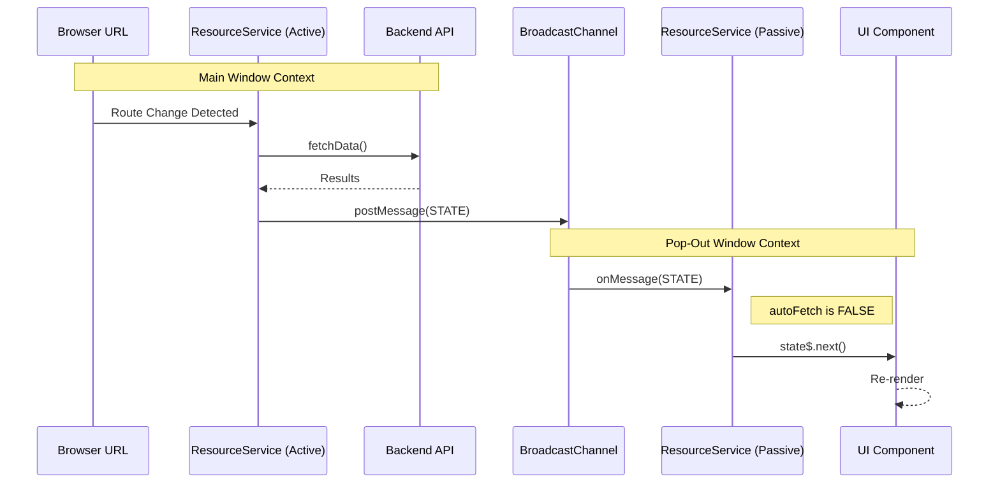

# Generic Prime Engineering Manual

**Version**: 5.70
**Last Updated**: December 27, 2025
**Scope**: Full Stack Architecture & Implementation Details

---

## 1. Architectural Philosophy

Generic Prime is built on a strict **Inversion of Control (IoC)** philosophy designed to solve three specific problems in data-heavy applications:
1.  **Domain Coupling**: Traditional apps tightly couple UI to business logic. Generic Prime decouples them completely via the `DomainConfig` abstraction.
2.  **State Synchronization**: Multi-window applications usually require complex WebSocket backends or polling. Generic Prime uses a client-side **Passive Brain** architecture to sync windows with zero API overhead.
3.  **URL as Source of Truth**: To support deep linking and history, the application forbids internal state that isn't reflected in the URL.

---

## 2. Conceptual Layer Model

The application is structured into five distinct conceptual layers. Code in one layer may only depend on layers below it, never above.

| Layer | Name | Responsibility | Key Abstractions |
| :--- | :--- | :--- | :--- |
| **L4** | **Wiring Layer** | Glues Framework to Domain. Connects Components to Config. | `DiscoverComponent`, `PanelPopoutComponent`, `AppModule` |
| **L3** | **Domain Layer** | Concrete implementation of business logic. | `AutomobileDomainConfig`, `AutomobileApiAdapter` |
| **L2** | **Abstraction Layer** | Interfaces defining the "Shape" of a domain. | `DomainConfig<T>`, `IApiAdapter`, `IFilterUrlMapper` |
| **L1** | **Framework Layer** | Generic UI and State engines. Domain-blind. | `ResourceManagementService`, `QueryControlComponent` |
| **L0** | **Platform Layer** | Boot, Routing, Build System, Runtime. | `main.ts`, `nginx.conf`, Docker, K8s |

---

## 3. Layer Detail & File Map

### Layer 0: Platform & Runtime
**Role**: The bedrock. Handles how the application boots, routes, and runs in production.

*   **Runtime**:
    *   `frontend/nginx.conf`: Configures Nginx as a reverse proxy (`/api` -> backend) and SPA router.
    *   `frontend/Dockerfile.prod`: Multi-stage build (Node builder -> Nginx runner).
*   **Boot**:
    *   `frontend/src/main.ts`: Angular bootstrap entry point.
    *   `frontend/src/app/app.module.ts`: Root Module. **Critical**: Provides `DOMAIN_CONFIG` via `createAutomobileDomainConfig`.
*   **Routing**:
    *   `frontend/src/app/app-routing.module.ts`: Defines the URL structure.
        *   `/automobiles/discover`: The main dashboard.
        *   `/panel/:grid/:id/:type`: The pop-out window route.

### Layer 1: The Framework (The Engine)
**Role**: A reusable engine that knows *how* to filter and display data but doesn't know *what* the data is.

#### L1.1: State Management (The "Nervous System")
*   `frontend/src/framework/services/resource-management.service.ts`: **The Brain**.
    *   **Implication**: Provided at *Component Level*. Creates independent instances for Main vs. Pop-out windows.
    *   **Logic**: Active Mode (Fetch from API) vs. Passive Mode (Listen to Broadcast).
*   `frontend/src/framework/services/url-state.service.ts`: **The Spinal Cord**.
    *   **Role**: Wraps Angular Router. ensures `router.navigate` is the *only* way to change state.
*   `frontend/src/framework/services/popout-context.service.ts`: **The Telepathy**.
    *   **Role**: Wraps `BroadcastChannel`. Uses `ReplaySubject(10)` to prevent race conditions during window opening.

#### L1.2: Generic UI Components (The "Organs")
These components receive `DomainConfig` as an `@Input()` and render accordingly.
*   `frontend/src/framework/components/query-control/`: Renders filters (Text, Range, Multiselect).
    *   *Dual Mode*: logic to listen to `UrlState` (Main) OR `PopOutContext` (Pop-out).
*   `frontend/src/framework/components/results-table/`: Renders data grid.
    *   *Pure Consumer*: Only knows it receives `results$: Observable<T[]>`.
*   `frontend/src/framework/components/statistics-panel/`: Renders Plotly charts.

### Layer 2: The Abstraction (The Interface)
**Role**: Defines the contract that Layer 3 must fulfill. This allows Layer 1 to operate blindly.

*   `frontend/src/framework/models/domain-config.interface.ts`: The Master Interface.
    *   Defines: `apiAdapter`, `urlMapper`, `filters`, `tableConfig`.
*   `frontend/src/framework/models/resource-management.interface.ts`: Defines the API contract (`fetchData`).

### Layer 3: The Domain (The Personality)
**Role**: Concrete implementation for a specific business vertical (e.g., Automobiles).

*   **Configuration**:
    *   `frontend/src/domain-config/automobile/automobile.domain-config.ts`: The Factory. Assembles the domain.
*   **Adapters**:
    *   `frontend/src/domain-config/automobile/adapters/automobile-api.adapter.ts`: Translates generic `filters` into specific REST calls (`GET /vehicles?make=Ford`).
    *   `frontend/src/domain-config/automobile/adapters/automobile-url-mapper.ts`: Serializes objects to URL strings.
*   **Definitions**:
    *   `frontend/src/domain-config/automobile/configs/*.ts`: Static JSON definitions for Table Columns, Filter Fields, and Chart Options.

### Layer 4: The Wiring (The Glue)
**Role**: Instantiates Layer 1 components and feeds them Layer 3 configuration.

*   `frontend/src/app/features/discover/discover.component.ts`: **The Orchestrator**.
    *   **Role**: The Main Window Controller.
    *   **Logic**:
        *   Injects `DOMAIN_CONFIG`.
        *   Broadcasts state changes to pop-outs.
        *   Manages the grid layout.
*   `frontend/src/app/features/panel-popout/panel-popout.component.ts`: **The Satellite**.
    *   **Role**: The Pop-Out Window Controller.
    *   **Logic**:
        *   Injects `IS_POPOUT_TOKEN: true`.
        *   Disables API fetching in its local `ResourceManagementService`.
        *   Renders a *single* component (e.g., just the Table) based on route params.

---

## 4. Deep Dive: The "Passive Brain" State Machine

The most critical architectural pattern in Generic Prime is the split-brain state management.

### Why this matters?
1.  **Performance**: If a user opens 4 pop-out windows (Table, Charts, Filters, Details), a traditional app might trigger 5 identical API calls on every filter change. Generic Prime triggers **1**.
2.  **Consistency**: There is no "lag" between windows. They display the exact same state snapshot because they share the exact same state object passed via the channel.

---

## 5. Deployment Topology

The application is deployed as a containerized artifact.

*   **Container**: `localhost/generic-prime-frontend:prod`
*   **Orchestrator**: Kubernetes (K3s)
*   **Node Affinity**: Pinned to `thor` (Host Machine)
*   **Network**:
    *   Ingress: `generic-prime.minilab`
    *   Internal: `ClusterIP` Service on Port 80
    *   API: Proxy pass to `generic-prime-backend-api`

---

## 6. Developer Guide: Adding a New Domain

To add "Physics" as a new domain, a developer acts **only** in Layer 3.

1.  **Create Directory**: `frontend/src/domain-config/physics/`
2.  **Define Models**: `physics.filters.ts`, `physics.result.ts`.
3.  **Implement Adapters**: `PhysicsApiAdapter` (implements `IApiAdapter`).
4.  **Define UI**: `physics.table-config.ts`, `physics.filter-definitions.ts`.
5.  **Assemble**: Create `physics.domain-config.ts` factory.
6.  **Wire (L0)**: Add provider in a new `PhysicsModule` or lazy route.

**Result**: A fully functional Physics discovery app with zero changes to Framework (L1) code.

---
