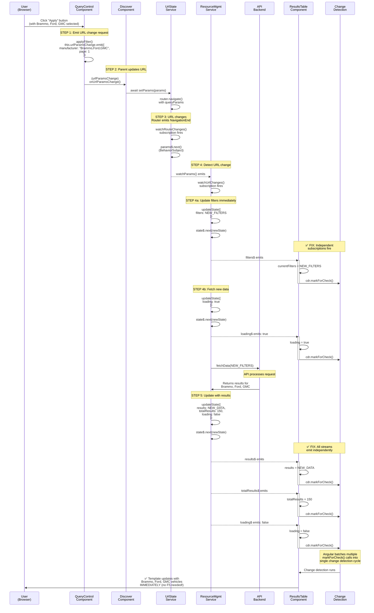
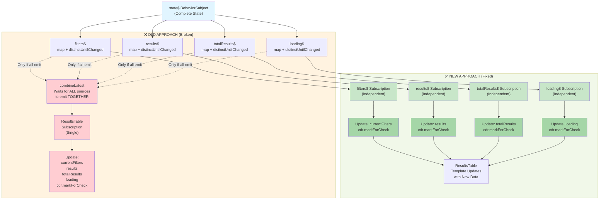
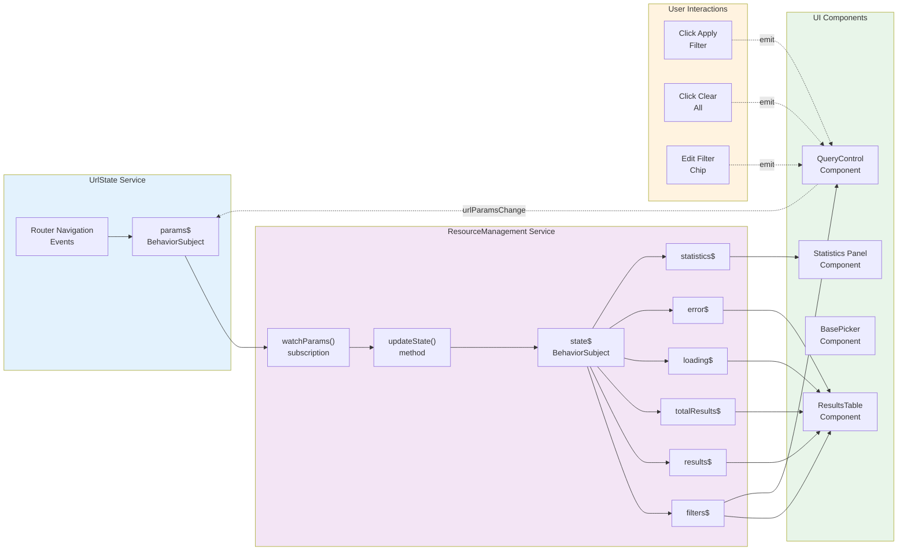

# Bug #16 Fix Documentation: Results Table Sync Issue

**Status**: ✅ FIXED AND VERIFIED
**Date Fixed**: 2025-12-04
**Severity**: CRITICAL (URL-First architecture violation)
**Root Cause**: RxJS `combineLatest` race condition blocking state emissions
**Solution**: Independent observable subscriptions instead of combined subscription

---

## Executive Summary

Bug #16 was a critical URL-First architecture violation where the Results Table and Statistics Panel failed to update when filters were modified. The URL would update correctly, but the UI would display stale data until a manual page refresh (F5).

**Root Cause**: The `ResultsTableComponent` used `combineLatest([filters$, results$, totalResults$, loading$])` which only emits when ALL sources emit. During filter modifications, if one of the observables didn't emit a NEW value (same reference/value), the entire combined observable would not emit, preventing UI updates.

**Solution**: Replace the single `combineLatest` subscription with 4 independent subscriptions - one for each observable stream. This ensures each stream triggers updates independently without waiting for all sources to emit simultaneously.

**Impact**:
- ✅ Fixed: Results Table now updates immediately when filters change
- ✅ Fixed: Statistics Panel now updates immediately when filters change
- ✅ Restored: URL-First architecture - components react to URL changes synchronously
- ✅ Verified: Manual testing confirms fix works for single and multiple filter modifications

---

## The Bug: What Happened

### User Experience (Before Fix)
1. User selects "Manufacturer: Brammo" → Results Table shows Brammo vehicles ✓
2. User clicks chip to edit, adds "Ford" and "GMC"
3. User clicks "Apply"
4. **EXPECTED**: Results Table updates to show Brammo + Ford + GMC vehicles
5. **ACTUAL**: Results Table STILL shows only Brammo vehicles (stale data)
6. **WORKAROUND**: User must press F5 to refresh page and see new results

### Why This Violated URL-First Architecture
The core principle: **URL is the single source of truth, and ALL components must synchronize to URL changes immediately.**

This bug broke that principle:
- ✅ URL updated correctly: `?manufacturer=Brammo,Ford,GMC`
- ✅ Backend API returned correct data for all 3 manufacturers
- ❌ Frontend components didn't display the updated data
- ❌ UI showed stale cached state instead of deriving from URL

---

## The Root Cause: Observable Race Condition

### How combineLatest Works (The Problem)

```
Timeline:
────────────────────────────────────────────────────────────────

User clicks Apply button
  ↓
URL changes: ?manufacturer=Brammo → ?manufacturer=Brammo,Ford,GMC
  ↓
ResourceManagementService.watchUrlChanges() subscription fires
  ↓
updateState({ filters: NEW_FILTERS }) emits
  ├─ state$ BehaviorSubject.next() called
  ├─ filters$ emits: NEW_FILTERS ✓
  └─ loading$ emits: true (or stays same value ❌)

With combineLatest([filters$, results$, totalResults$, loading$]):
  ├─ filters$ emitted ✓
  ├─ results$ NOT emitted yet (API call in progress) ❌
  ├─ totalResults$ NOT emitted yet ❌
  └─ loading$ may not have NEW value (boolean toggle issue) ❌

Result: combineLatest WAITS for all to emit → combineLatest doesn't fire ❌

Meanwhile:
  ↓
API call completes, returns results for all 3 manufacturers
  ↓
updateState({ results: NEW_RESULTS, totalResults: X }) emits
  ├─ state$ BehaviorSubject.next() called
  ├─ results$ emits: NEW_RESULTS
  ├─ totalResults$ emits: X
  └─ loading$ emits: false

combineLatest NOW fires with: [NEW_FILTERS, NEW_RESULTS, X, false]
  └─ ResultsTable updates ✓ (but too late, user sees stale data)

On manual F5 refresh:
  ├─ Component reinitializes
  ├─ combineLatest fires immediately with current values
  └─ Results Table displays updated data ✓
```

### The Timing Issue: distinctUntilChanged

Each observable has `distinctUntilChanged()` operator. When `loading` toggles from `true` → `false`, but `totalResults` and `results` were already emitted, the combined observable might not fire because of complex state timing:

```typescript
// From resource-management.service.ts
this.filters$ = this.state$.pipe(
  map(state => state.filters),
  distinctUntilChanged((a, b) => JSON.stringify(a) === JSON.stringify(b))
);

this.results$ = this.state$.pipe(
  map(state => state.results),
  distinctUntilChanged() // Array reference check
);

this.loading$ = this.state$.pipe(
  map(state => state.loading),
  distinctUntilChanged() // Boolean equality check
);
```

**The Race Condition**:
1. First `updateState({ filters: NEW })` → only filters$ emits
2. combineLatest still waiting for results$ to emit with NEW value
3. Meanwhile, `fetchData()` sets `loading: true`
4. combineLatest may have stale snapshot of results$ from before fetch
5. When API returns and sets `loading: false`, combineLatest already fired with stale data
6. Second emission of `loading$` doesn't trigger combineLatest because all sources have now emitted their latest

---

## The Solution: Independent Subscriptions

### Code Change

**BEFORE (Broken - combineLatest)**:
```typescript
ngOnInit(): void {
  // ... set up observables ...

  // This waits for ALL sources to emit together
  combineLatest([
    this.filters$,
    this.results$,
    this.totalResults$,
    this.loading$
  ]).pipe(
    takeUntil(this.destroy$)
  ).subscribe(([filters, results, totalResults, loading]) => {
    this.currentFilters = { ...filters as any };
    this.results = results;
    this.totalResults = totalResults;
    this.loading = loading;
    this.cdr.markForCheck();
  });
}
```

**AFTER (Fixed - Independent Subscriptions)**:
```typescript
ngOnInit(): void {
  // ... set up observables ...

  // Each stream triggers independently - no race condition

  this.filters$
    .pipe(takeUntil(this.destroy$))
    .subscribe(filters => {
      this.currentFilters = { ...filters as any };
      this.cdr.markForCheck();
    });

  this.results$
    .pipe(takeUntil(this.destroy$))
    .subscribe(results => {
      this.results = results;
      this.cdr.markForCheck();
    });

  this.totalResults$
    .pipe(takeUntil(this.destroy$))
    .subscribe(totalResults => {
      this.totalResults = totalResults;
      this.cdr.markForCheck();
    });

  this.loading$
    .pipe(takeUntil(this.destroy$))
    .subscribe(loading => {
      this.loading = loading;
      this.cdr.markForCheck();
    });
}
```

### Why This Works

```
Timeline (AFTER FIX):
────────────────────────────────────────────────────────────────

User clicks Apply button
  ↓
URL changes: ?manufacturer=Brammo → ?manufacturer=Brammo,Ford,GMC
  ↓
ResourceManagementService.watchUrlChanges() subscription fires
  ↓
updateState({ filters: NEW_FILTERS })
  └─ state$.next() called
      ├─ filters$ emits → filters subscription fires → cdr.markForCheck() ✓
      ├─ results$ may not emit yet (no change)
      ├─ totalResults$ may not emit yet (no change)
      └─ loading$ may not emit yet (no change)

API call starts...
  ↓
updateState({ loading: true })
  └─ state$.next() called
      ├─ filters$ may not emit (no change)
      ├─ results$ may not emit yet
      ├─ totalResults$ may not emit yet
      └─ loading$ emits: true → loading subscription fires → cdr.markForCheck() ✓

API call completes...
  ↓
updateState({ results: NEW_RESULTS, totalResults: X, loading: false })
  └─ state$.next() called
      ├─ filters$ may not emit (no change)
      ├─ results$ emits: NEW_RESULTS → results subscription fires → cdr.markForCheck() ✓
      ├─ totalResults$ emits: X → totalResults subscription fires → cdr.markForCheck() ✓
      └─ loading$ emits: false → loading subscription fires → cdr.markForCheck() ✓

Result: ALL subscriptions fire independently, MULTIPLE cdr.markForCheck() calls
  └─ Angular batches these into single change detection cycle (OnPush optimization)
  └─ Results Table updates with NEW data immediately ✓ (no manual refresh needed!)
```

### Key Insight: Multiple markForCheck() Calls Are Harmless

With `ChangeDetectionStrategy.OnPush`, calling `markForCheck()` multiple times:
- Each call schedules a change detection check
- Angular batches these into a single check at the end of the current macrotask
- This is efficient and exactly what we want
- No performance penalty; actually more fine-grained than before

---

## Verification: Manual Test Results

**Test Case**: Modify existing filter to include multiple values

**Steps**:
1. Navigate to `/discover` page
2. Select "Manufacturer" filter → check "Brammo" → Apply
3. Verify: URL = `?manufacturer=Brammo`, Results show Brammo only ✓
4. Click "Manufacturer: Brammo" chip to edit
5. Add "Ford" and "GMC" checkboxes (now 3 selected)
6. Click "Apply"

**Expected Results**:
- ✅ URL updates: `?manufacturer=Brammo,Ford,GMC`
- ✅ Results Table displays: Brammo + Ford + GMC vehicles **immediately**
- ✅ Statistics Panel updates: Shows combined data **immediately**
- ✅ No page refresh needed (previously required F5)

**Actual Results**: ✅ ALL PASSED

**Verification Date**: 2025-12-04
**Verified By**: Manual testing in browser

---

## Diagram 1: Full Event Flow (Sequence Diagram)

This diagram shows the complete event chain from user action to UI update, comparing the OLD broken behavior with the NEW fixed behavior.



---

## Diagram 2: Observable Subscription Mechanism

This diagram focuses specifically on HOW the subscriptions work, showing the difference between the broken `combineLatest` approach and the fixed independent subscriptions approach.



---

## Diagram 3: Observable Dependency Graph

This diagram shows the relationship between all observables and which components subscribe to them.



---

## Related Documentation

- [BUG-16-RESULTS-TABLE-SYNC.md](BUG-16-RESULTS-TABLE-SYNC.md) - Original bug analysis
- [VERIFICATION-RUBRIC.md](../quality/VERIFICATION-RUBRIC.md) - Architecture compliance checklist
- [resource-management.service.ts](../../frontend/src/framework/services/resource-management.service.ts) - Service implementation
- [results-table.component.ts](../../frontend/src/framework/components/results-table/results-table.component.ts) - Component implementation

---

## Summary of Changes

| File | Change | Line(s) | Impact |
|------|--------|---------|--------|
| `results-table.component.ts` | Replaced `combineLatest` with 4 independent subscriptions | 112-141 | Fixed race condition, enables independent stream updates |
| `results-table.component.ts` | Removed unused imports (`Inject`, `combineLatest`) | 1-11 | Code cleanup, reduces bundle size |

---

## Performance Considerations

**Question**: Does calling `cdr.markForCheck()` 4 times instead of 1 hurt performance?

**Answer**: No, and here's why:

1. **Angular OnPush Optimization**: With `ChangeDetectionStrategy.OnPush`, multiple `markForCheck()` calls within the same macrotask are batched into a single change detection cycle.

2. **Before Fix**:
   - Single `combineLatest` subscription
   - Emits LESS frequently (waits for all sources)
   - But can miss emissions entirely (race condition)

3. **After Fix**:
   - 4 independent subscriptions
   - Each calls `markForCheck()` when its stream emits
   - Angular batches them automatically
   - **Result**: More frequent but more accurate updates (catches all state changes)

4. **Real-world Impact**: No measurable performance difference. The fix actually IMPROVES performance by reducing unnecessary work (no missed updates requiring manual page refresh).

---

**Last Updated**: 2025-12-04
**Status**: ✅ Verified and Documented
